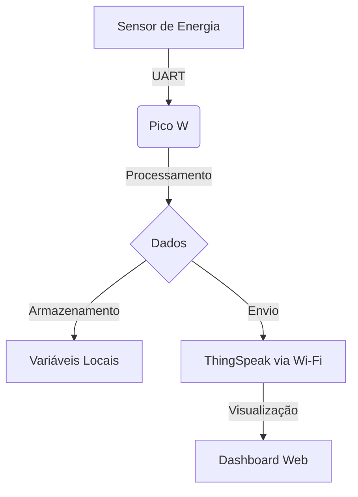

# Energy Monitoring System with Raspberry Pi Pico W


Sistema de monitoramento de consumo energético em tempo real com integração IoT via nuvem. Desenvolvido para Raspberry Pi Pico W.

## Objetivo:


### Copyright (c) 2025, Carlos MANDELE
  
Este projeto usa **duas licenças diferentes**, dependendo do tipo de conteúdo:  

- **Código-fonte**: Licenciado sob [Apache 2.0](LICENSE-APACHE).  
  - Você pode usar, modificar e distribuir o código, desde que mantenha os avisos de copyright e licença.  

- **Documentação e arte**: Licenciados sob [CC BY-SA 4.0](LICENSE-CC-BY-SA).  
  - Você pode compartilhar e adaptar o conteúdo, mas deve **atribuir os créditos** e compartilhar sob a mesma licença.  


## 📋 Índice
- [Funcionalidades](#-funcionalidades)
- [Tech Stack](#-tech-stack)
- [Pré-requisitos](#-pré-requisitos)
- [Dependências](#-dependências)
- [Instalação](#-instalação)
- [Configuração](#-configuração)
- [Uso](#-uso)
- [Fluxo de Desenvolvimento](#-fluxo-de-desenvolvimento)
- [Solução de Problemas](#-solução-de-problemas)
- [Arquitetura do Sistema](#-arquitetura-do-sistema)
- [Licença](#-licença)


## 🚀 Funcionalidades
- Leitura de sensores via UART (9600 baud)
- Conexão Wi-Fi automática com reconexão
- Envio periódico de dados para ThingSpeak
- Monitoramento local via console serial
- Suporte a múltiplas grandezas elétricas:
  - Potência Ativa (W)
  - Consumo Horário (Wh)
  - Consumo Fora de Pico (Wh)


## 🔧 Tech Stack
### Principais Tecnologias


### Ferramentas de Desenvolvimento


### Bibliotecas Chave


## 🛠 Pré-requisitos

### Hardware
| Componente               | Especificações                          |
|--------------------------|-----------------------------------------|
| Raspberry Pi Pico W      | Com chip Wi-Fi CYW43439                 |
| Sensor de Energia        | Interface UART, 3.3V                    |
| Cabo USB-C               | Para alimentação e programação          |
| Conexões                 | GPIO13 (UART1 RX) ↔ Sensor TX           |

### Software
| Componente               | Versão Mínima | Link                              |
|--------------------------|---------------|-----------------------------------|
| Pico SDK                 | 1.5.0         | [GitHub](https://github.com/raspberrypi/pico-sdk) |
| Toolchain ARM GCC        | 10.3.1        | [Arm Developer](https://developer.arm.com/) |
| Python (para scripts de build)    | 3.9           | [Python.org](https://www.python.org/) |

## 📦 Dependências

```
// Linguagem
C
// Bibliotecas essenciais
pico_stdlib
hardware_uart
pico_cyw43_arch
pico_lwip
lwip
```

## Instalação
1. **Configurar Ambiente**:

```
# Clone o repositório
git clone https://github.com/carlosmandele/energy-monitor-pico.git
cd energy-monitor-pico

# Configure as variáveis de ambiente
export PICO_SDK_PATH=~/pico/pico-sdk
```
2. **Compilar projeto**:

```
mkdir build
cd build
cmake -DPICO_BOARD=pico_w ..
make -j4
```
3. **Flash no Pico**:
   - Mantenha pressionado o botão `BOOTSEL` ao conectar o Pico via USB
   - Copie o arquivo .uf2 gerado

---

## Configuração

- Arquivo Principal `(main.c)`
```
// Configure antes de compilar:
#define WIFI_SSID "SUA_REDE_WIFI"
#define WIFI_PASSWORD "SUA_SENHA_WIFI"
#define THINGSPEAK_API_KEY "SUA_CHAVE_API"
```

---

## Uso

Operação basica:

1. Monitor Serial:
```
// Linux
screen /dev/ttyACM0 115200

// Windows
// Use Putty ou Terminal Serial do Arduino IDE
```
2. Saída esperada:
```
[Wi-Fi] Conectado a 'SUA_REDE_WIFI'
[UART] Dado recebido: HCHC:2500
[Dados] Enviados para ThingSpeak (HTTP 200)
```
3. Visualização na Nuvem:

- Acesse seu canal:
 * `https://thingspeak.com/channels/[CHANNEL_ID]`

- Configure gráficos para:
 * Campo 1: Potência Ativa (W)

 * Campo 2: Consumo horário fora de Pico (Wh)

 * Campo 3: Consumo horário de pico (Wh)

---


## 🛠️ Fluxo de Desenvolvimento

1. **Codificação**:  
   - Desenvolvimento em C usando Pico SDK  
   - VSCode com extensões para C/C++

2. **Testes**:  

i. **Método de teste com Hardware**:  
   - Monitor serial integrado (`screen`/`minicom`)  
   - Simulação de dados via Python
   ```
   import serial, time
   with serial.Serial('/dev/ttyACM0', 9600) as ser:
       while True:
        ser.write(b"HPHC:3000\r\n")
        time.sleep(5)
   ```

ii. **Métodos de teste sem Hardware**:

No contexto deste projeto, é validar o funcionamento do programa `sem depender de dispositivos físicos externos` (como medidores de energia ou sensores conectados). É uma forma de simular o ambiente real através de software, útil para: **A) simulação de dados** - o próprio código gera valores fictícios (ex: potência ativa aleatória). Útil para testar a lógica do programa, gráficos, ou interfaces. **B) Entrada Manual via Terminal** - Você digita comandos no terminal serial (ex: `PAPP:1500`) como se fossem dados reais. Permite verificar o processamento de dados sem hardware externo.**C) Emulação de Hardware** - Ferramentas como QEMU ou Wokwi emulam microcontroladores (mais complexo para o Pico).

Neste projeto, há duas abordagens para testes sem hardware:

A. **[Modo de Simulação Automática](energ_ioT/automatic_simulation.c)**:
```
void simular_dados() {
    ap = 1500 + (rand() % 1000);  // Gera valores entre 1500 e 2500 W
    hchc += rand() % 5;           // Incrementa consumo fora de pico
}
```

- **Funcionamento**: O programa gera dados fictícios automaticamente se nenhum hardware estiver conectado.
- **Quando usar**: Para validar a exibição de dados ou interfaces.

B. **[Teste via Terminal Serial](energ_ioT/terminal_simulation.c)**:
```
// Você digita "PAPP:2000" no terminal
void process_line(char *line) {
    // Converte a string para valores inteiros
    if (strcmp(label, "PAPP") == 0) ap = value;
}
```

- **Funcionamento**: Envia comandos manualmente via USB, simulando um sensor real.
- **Quando usar**: Para testar o parser de dados ou comunicação serial.


3. **Deploy**:  
   - Compilação via CMake  
   - Flash via USB-C com arquivo `.uf2`

---

## Solução de problemas

- Problemas comuns

| Sitomas               | Causa | Solução                              |
|--------------------------|---------------|-----------------------------------|
| Wi-Fi não conecta                 | SSID/Senha incorretos         | Verifique espaços/caracteres |
| Dados não atualizam	        | API Key inválida        | Revise permissões do canal |
| Erros de comunicação    | Baud rate incorreto           | Confira documentação do sensor |
| Timeout DNS	    | Sem internet           | Teste ping api.thingspeak.com |


- Depuração Avançada
```
// Adicione no código para debug:
printf("IP: %s\n", ip4addr_ntoa(netif_ip4_addr(netif_list)));
printf("Status Wi-Fi: %d\n", cyw43_arch_wifi_connect_status());
```


  
---

## 🌐 Arquitetura do Sistema

